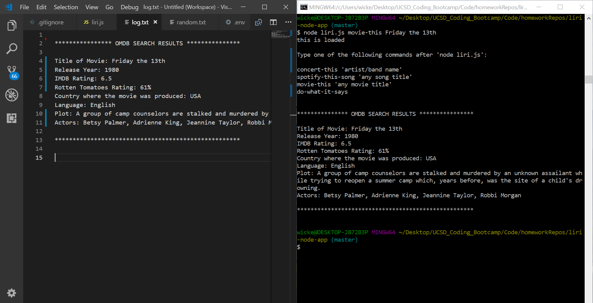

# liri-node-app

# Project Description

LIRI Bot is a command line Node app that takes in parameters and returns data. Through the use of APIs, users can search Spotify for songs, Bands In Town for concerts, and OMDB for movies. These searches are made by using specific commands, depending on what the user would like to search for. LIRI Bot employs the use of NPM packages, including Moment, Request, and the Node-Spotify-API pacakge. The FS package is also used to take the text inside of the "random.txt" file and then use it to call one of LIRI's commands. So, when you type in the "do-what-it-says" command, "spotify-this-song,'I Want it That Way'" will be written into the "random.txt" file. As an added bonus, a "log.txt" file has been created so that in addition to logging the data (i.e. search results) to the terminal, the data will also append to the "log.txt" file. Each search result is added to the file without overwriting the previous entries, so that you have a complete list of search results generated from the user's search queries.

# The Four Commands and What They Output

* concert-this
  * Lineup
  * Name of Venue
  * Venue Location
  * Date of Event (Moment is used to format this as "MM/DD/YYYY")
* spotify-this-song
  * Artist(s)
  * Song Title
  * URL Preview
  * Album
  * If no song is provided, the program will default to "The Sign" by Ace of Base.
* movie-this
  * Title of Movie
  * Release Year
  * IMDB Rating
  * Rotten Tomatoes Rating
  * Country where the movie was produced
  * Language
  * Plot
  * Actors
  * If no movie is provided, the program will default to the movie 'Mr. Nobody'.
* do-what-it-says
  * This command uses fs.writeFile to write to random.txt.
* BONUS
  * fs.appendFile is used to append search results to a .txt file called "log.txt".
  * These files are not overwritten each time a new command is run.
* To see a list of the commands and how to use them, simply run the application by typing 'node liri.js' in the terminal.

# Technologies Used

* Node.js
* APIs from Bands In Town, Spotify, and OMBD
* NPM packages:  Request, Moment, Node-Spotify-API, and fs

# LIRI Bot Demo

Since this is a command line application, there is no HTML page to see this app in action. You can see the LIRI Bot application in action in my demo video. Here is a link to the demo video:

https://drive.google.com/file/d/1zTTCWQ063xKTVHmKXtmQ4XHE-XpSAP_5/view

# Screenshots

